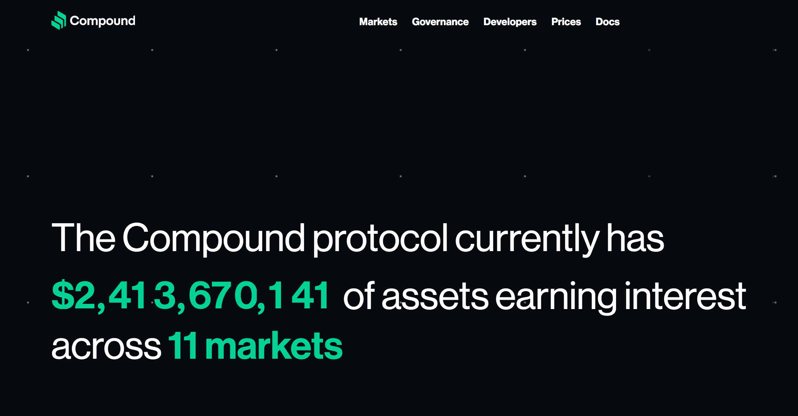
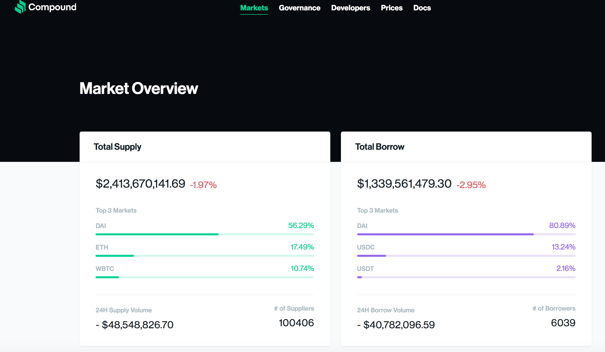
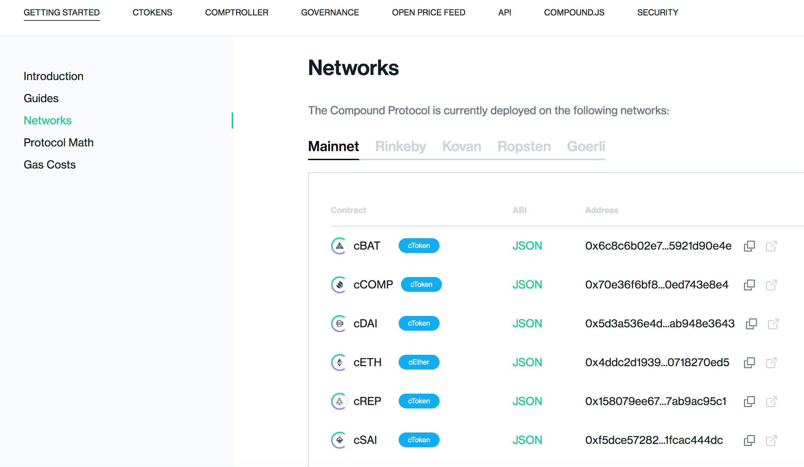

## Summary

REST API to interact with a DeFi protocol, built with Node.js

4 endpoints:
1. get token balance
2. get cToken balance
3. mint cToken
4. redeem cToken

API for Compound, defi lending protocol https://compound.finance/

### Testing on local machine

create .env in root directory

login to infura, get INFURA_URL

get test PRIVATE_KEY https://vanity-eth.tk/

`nvm install 16.15.1`

`npm install`

`npm start`

`curl http://localhost:3000/tokenBalance/cDai/0x0d0289e9f3eae696fa38e86fc4456228dc1792a7`

`curl http://localhost:3000/cTokenBalance/cDai/0x0d0289e9f3eae696fa38e86fc4456228dc1792a7`

### Web3 contract instance (need ABI and address of smart contract)

https://compound.finance/docs#networks 

config.json has cBatAddress, cDaiAddress, cTokenABI, ERC20ABI

### Deployed to Heroku

https://pure-ridge-83476.herokuapp.com/

test: `curl https://pure-ridge-83476.herokuapp.com/tokenBalance/cDai/0x0d0289e9f3eae696fa38e86fc4456228dc1792a7`

### To do

add other endpoints for functions from Compound's smart contact

add endpoints for other DeFi protocols (UniSwap, MakerDAO) https://defipulse.com/

https://compound.finance/docs

https://medium.com/compound-finance/compound-ethereum-api-with-infura-1f5c555fd4a2